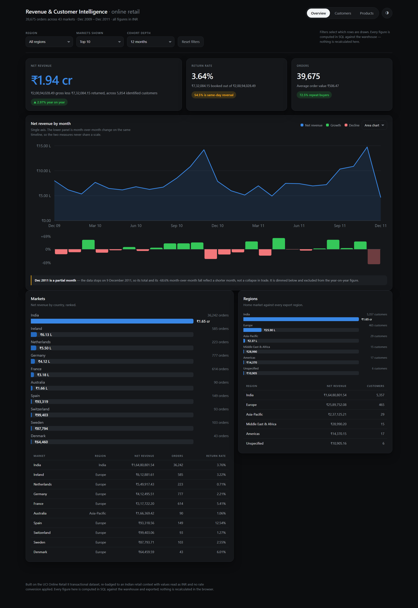
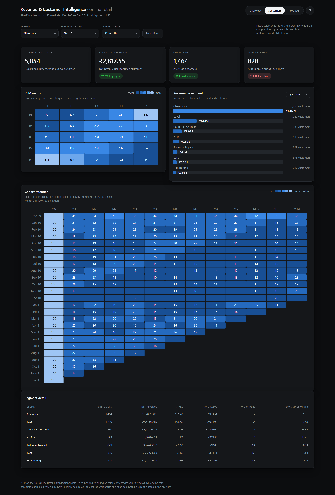
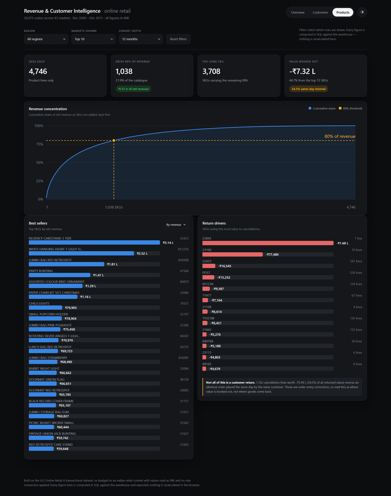

# E-Commerce Revenue and Customer Intelligence

I built this to answer four revenue questions on two years of online retail transactions, and to
answer them the same way twice. One command takes the raw Kaggle workbook through cleaning, a
SQLite star schema, six marts and an executive dashboard, and every figure on the dashboard traces
back to a SQL file.

## Provenance, stated up front

The source is the UCI Online Retail II dataset, the transaction log of a UK-based online giftware
retailer, published on Kaggle. I re-badged the home market to India and read every value as INR
with **no rate conversion applied**. The magnitudes are exactly the source data's; only the labels
differ. The product catalogue, the export markets and the customer behaviour are all the source
data's as delivered. This is a relabelling for presentation, not an Indian dataset, and I say so
here, in the audit workbook and in the dashboard footer.

## The four questions

1. Where does the revenue come from, and how is it trending?
2. Which customers are worth spending retention money on?
3. Which products and which markets carry the revenue?
4. How much revenue leaks back out through cancellations, and where?

## Headline findings

- Net revenue of **₹19,361,944.34** over 25 months to 9 December 2011: gross ₹20,094,028.49 less
  ₹732,084.15 of returns, across 39,675 orders at an average order value of ₹506.47. The trailing
  twelve months are up **2.97%** on the twelve before them.
- **The 3.64% headline return rate is not a goods-returned rate.** 1,762 cancellation lines worth
  **−₹399,268.39**, 54.54% of all returned value, reverse an identical order placed the same day by
  the same customer. Strip them and the rate falls to **1.66%**.
- Revenue is concentrated twice over. **1,038 of 4,746 SKUs (21.87%) carry 80% of net revenue**,
  and **1,464 Champions, 25.01% of scoreable customers, carry 70.15%** of the ₹16,493,962.86
  attributable to identified customers.
- **828 customers in At Risk and Cannot Lose Them hold ₹1,442,258.15** and have been silent for
  341 to 378 days on average. That is the retention budget's natural target.
- India is 85.12% of net revenue. Of the export markets, **Spain returns 12.54% of gross on 149
  orders** while the Netherlands returns 0.71% on the highest average order value of any market,
  ₹2,483.59.

`docs/findings.md` carries the full working and the recommendations.

## The dashboard

**Live: https://raghavmishra23.github.io/revenue-retention-online-retail/**

Three views over the exported marts. No server, no build step, no framework — `index.html` opens
from the filesystem and reads its data from a JavaScript global the pipeline writes. The page
formats and selects; it never divides, totals or ranks, so every figure on screen is one a SQL file
already computed.

**Overview** — the KPI row, net revenue by month with the month-on-month change on a second panel,
and revenue by market and region.



**Customers** — the RFM matrix, revenue by segment, the cohort retention heatmap, and the segment
table behind the retention argument.



**Products** — the Pareto curve with the 80% threshold marked, best sellers, and the SKUs losing
the most value to cancellations.



The three filters at the top — region, markets shown, cohort depth — select among pre-computed
rows rather than recomputing aggregates, which is the honest limit of exporting the answers ahead
of time. The toggle at the top right switches between the dark and light themes, and `?theme=light`
forces one on load.

The hosted copy is the `dashboard/` folder published to a `gh-pages` branch, so the served site and
the repository copy are the same files. After a rebuild changes the payload, republish with:

```bash
git subtree push --prefix dashboard origin gh-pages
```

## Running it

Python 3.12. On Windows, bare `python` is the Store stub, so use the launcher.

```bash
py -3.12 -m venv .venv
.venv/Scripts/python -m pip install -r requirements.txt
```

Ingest needs Kaggle credentials. Copy `.env.example` to `.env` and fill in `KAGGLE_USERNAME` and
`KAGGLE_KEY` from your Kaggle account's API token. The values are read through `os.environ` after
`load_dotenv()`, passed to the Kaggle CLI as child-process environment, and masked out of any error
text before it is logged or raised. `.env` is ignored by git.

```bash
.venv/Scripts/python -m src.pipeline --help
.venv/Scripts/python -m src.pipeline ingest      # Kaggle download into data/raw
.venv/Scripts/python -m src.pipeline audit       # pre-clean profile into excel/data_audit.xlsx
.venv/Scripts/python -m src.pipeline clean       # rules, DQ report, quarantine
.venv/Scripts/python -m src.pipeline warehouse   # star schema, marts, parquet export
.venv/Scripts/python -m src.pipeline dashboard   # the JSON payload the page reads
.venv/Scripts/python -m src.pipeline all         # every stage in order
```

Checks:

```bash
.venv/Scripts/python -m pytest -q
.venv/Scripts/python -m ruff check src tests
.venv/Scripts/python -m black src tests
```

Each stage is independent and reads what the one before it wrote, so a stage can be rerun on its
own once its input exists. What each one lands:

| Stage | Writes |
|---|---|
| `ingest` | `data/raw/online_retail_II.xlsx` plus `data/raw/checksums.json` |
| `audit` | `excel/data_audit.xlsx`, the reconciliation baseline |
| `clean` | `transactions.parquet`, `dq_report.json`, `quarantined_rows.parquet` |
| `warehouse` | `data/warehouse.sqlite` and six mart Parquet files |
| `dashboard` | `dashboard/data/dashboard_data.js` |

`all` runs the five in order. On my machine `clean`, `warehouse` and `dashboard` take roughly two,
three and four minutes, so a full rebuild is about ten minutes once the download is cached. The
pipeline is idempotent — a second run produces byte-identical processed output — so rerunning it
is always safe.

If a stage fails it fails loudly and stops. The gates are deliberate: row counts must reconcile as
`raw == kept + deduped + quarantined`, net revenue must agree across the workbook, the Python
output and the warehouse to within 0.01, `PRAGMA foreign_key_check` must come back empty, and
cohort retention at offset 0 must be exactly 100%. A plausible wrong number is worse than a stopped
run.

Open the dashboard by double-clicking `dashboard/index.html`. It has no dependencies and its data
is a JavaScript global, so it works from the filesystem with no server. If you would rather serve
it:

```bash
.venv/Scripts/python -m http.server 8000 --directory dashboard
```

then open `http://localhost:8000`.

Changing a figure on the page means changing the SQL behind it. Edit the mart in `sql/02_marts/`,
rerun `warehouse` and then `dashboard`, and the page picks it up on refresh.

## Architecture in brief

```text
Kaggle  ->  data/raw/online_retail_II.xlsx
              |
              |-- audit  ----> excel/data_audit.xlsx          (reconciliation baseline)
              |
            clean  ------> data/interim/raw_union.parquet     (normalised cache)
                           data/processed/transactions.parquet
                           data/processed/dq_report.json
                           data/quarantine/quarantined_rows.parquet
              |
            warehouse --> data/warehouse.sqlite               (star schema + 6 mart views)
                           data/processed/marts/*.parquet
              |
            dashboard --> dashboard/data/dashboard_data.js
                           dashboard/index.html
```

SQLite is the only engine, and `sqlite3` is imported in exactly one module. Cleaning is pure pandas
transforms; every number the dashboard shows is computed in SQL and exported, never recomputed in
the page. `docs/pipeline.md` has the stage contracts and the quality gates.

## Repository layout

| Path | Holds |
|---|---|
| `config/settings.yml` | paths, dataset slug, cleaning thresholds, audited totals, country regions |
| `src/pipeline.py` | the CLI, one subcommand per stage |
| `src/ingest/` | Kaggle download, checksum log, credential masking |
| `src/audit/` | the pre-clean Excel workbook |
| `src/clean/` | `rules.py` (one pure function per rule), `profile.py` (DQ metrics) |
| `src/model/` | dimension and fact builders |
| `src/warehouse/` | `engine.py` (connections and PRAGMAs), `load.py`, `export.py` |
| `src/dashboard/` | the mart-to-payload export |
| `sql/01_schema/` | DDL for the star schema and its indexes |
| `sql/02_marts/` | revenue trend, RFM, cohort, Pareto, return leakage, country performance |
| `sql/03_analysis/` | one query per business question |
| `dashboard/` | the HTML, CSS and SVG dashboard and its data payload |
| `tests/` | pytest suite, no network, throwaway SQLite in `tmp_path` |
| `docs/` | pipeline, data dictionary, findings, and the dashboard screenshots |

## Limitations

- **The relabelling is cosmetic.** Values are read as INR at the source magnitudes. Nothing here
  reflects Indian price levels.
- **Guests are in revenue but out of customer analytics.** 229,202 kept rows (22.3%) worth
  ₹2,724,218.55 (14.3%) have no customer ID. They count toward revenue and are excluded from RFM,
  cohort and customer value, because scoring them would invent customers.
- **5,854 of 5,939 identified customers are scoreable.** 62 appear only on adjustment or test lines
  and 23 only on cancellations, so they have no non-cancelled sales line to score.
- **December 2011 is a partial month.** The data stops on the 9th, so its −68.58% month-on-month
  fall is the calendar, not trading. It is excluded from the year-on-year window.
- **There is no cost data**, so everything here is revenue, not margin.
- **The star schema is rebuilt, not versioned.** Every `warehouse` run drops and reloads the
  tables, so there is no slowly changing dimension history.
